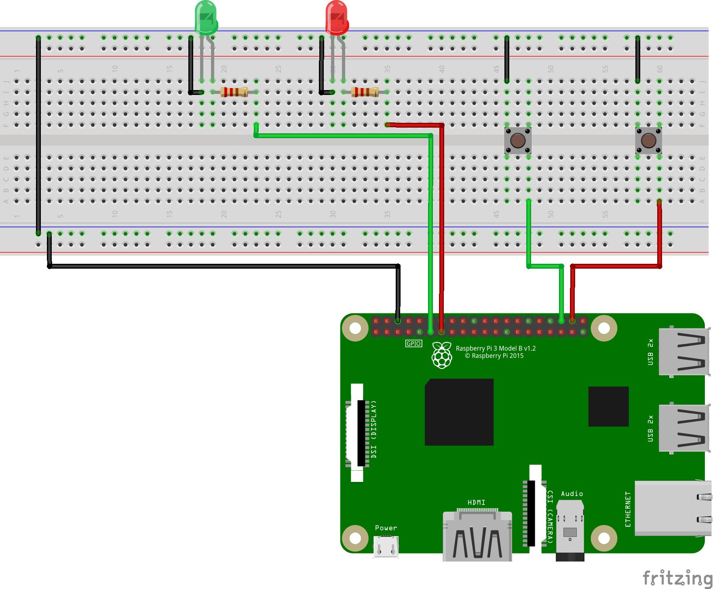

# P2-gpio-ledrgb

This exercise consists on drive two [LED's](https://github.com/clases-julio/p1-introrpi-pwm-dgarciac2021/wiki/LED) through [GPIO](https://github.com/clases-julio/p1-introrpi-pwm-dgarciac2021/wiki/GPIO) available on the [Raspberry Pi 3B+](https://github.com/clases-julio/p1-introrpi-pwm-dgarciac2021/wiki/Raspberry-Pi#raspberry-pi-3b) and the help of two buttons. You might want to take a look on the wiki, since there is info of everything involved on this project. From the [button](https://github.com/clases-julio/p3-interruptions-dgarciac2021/wiki/Button) to the [interruption procedure](https://github.com/clases-julio/p3-interruptions-dgarciac2021/wiki/Interruption).

## Circuit Assembly

This time the assembly gets a little bit more complex. We are using two buttons, two LED's and two 220Ω resistors.

This is an schematic made with [Fritzing](https://fritzing.org/):

And this is the real circuit!

## Code

We would like to highlight some remarkable aspects from our code.

## Circuit testing

This is the result! Pretty nice, isn't it?
